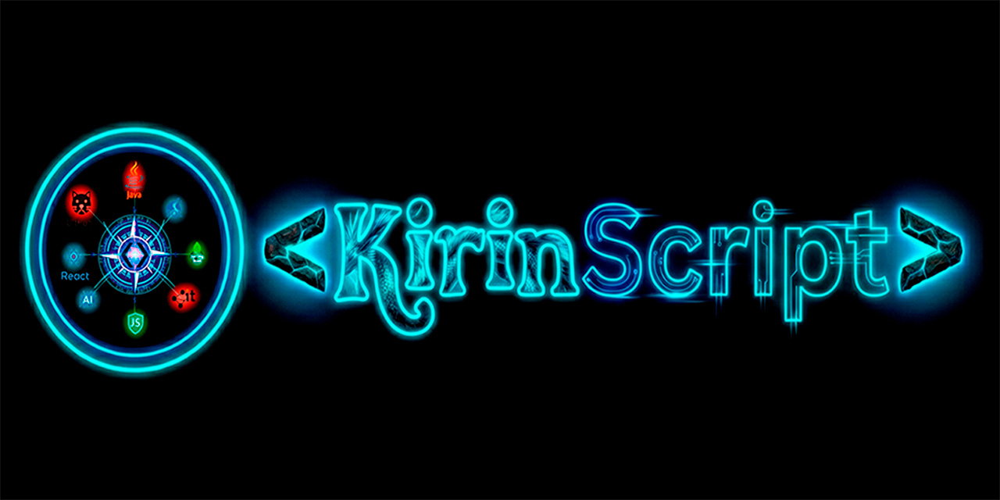

# Hola, soy Adrián Gustavo Salvini 👋

### Desarrollador FullStack | Java & React | AI-Enhanced Workflows

---

 <em>"Transformando experiencia industrial en código eficiente y escalable."</em>

### 👨‍💻 Sobre mí

Soy un **Desarrollador FullStack** con un enfoque práctico y autodidacta. Vengo de entornos industriales exigentes, lo que forjó mi capacidad para resolver problemas complejos bajo presión y buscar siempre la mejora continua.

Mi diferencial no es solo escribir código, sino cómo lo hago:
* 🚀 **Eficiencia:** Integro herramientas de **Inteligencia Artificial** para optimizar el ciclo de desarrollo.
* 🛠️ **Calidad:** Desarrollo soluciones funcionales con un estándar alto de limpieza y mantenimiento.
* 🎯 **Objetivo:** Busco aportar compromiso y mentalidad resolutiva en proyectos con **Java** y **React**.

---

### 💻 Tech Stack

Aquí están las tecnologías que utilizo para construir soluciones:

**Backend & Lenguajes**

  
  
  

**Frontend**

  
  
  
  

**Herramientas & Productividad**

  
  
  

---

### 📊 Actividad y Skills

  

 

  

---

### 📬 Conectemos

¿Buscas un desarrollador comprometido y resolutivo? ¡Hablemos!

• [🌐 Mi Portafolio Web] https://kirinscript.web.app

• [👔 LinkedIn] www.linkedin.com/in/adriansalviniprogramador

• [📧 Email] adriansalviniprogramador@gmail.com

